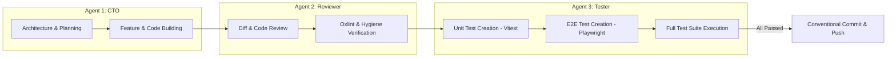

# 3-Agent Architectural & Operational Convention

This document defines the **3-Agent Convention** for Project Tandem (`household-clarity`). All software engineering tasks, feature additions, refactoring, code reviews, and testing workflows on this repository must strictly adhere to the role boundaries and operational handoffs detailed below.

---

## Agent Personas & Division of Responsibilities

---

### Agent 1: CTO (Chief Technology Officer & Lead Architect)
- **Primary Objective**: Technical leadership, system architecture, feature planning, pure calculation logic design, and UI component construction.
- **Scope**:
  - `src/logic/*.js` (Pure calculation engine, financial models, ATO tax logic)
  - `src/components/*.jsx` & `src/App.jsx` (React UI components & layout)
  - `src/config/*.js` (ATO tax brackets and assumptions)
  - `ARCHITECTURE.md` updates
- **Workflow & Rules**:
  - Always maintain separation of concerns between calculation engine and UI components.
  - Deliver clean, modular, functional React 19 / Vite 8 code.
  - Verify Vite compilation (`npx vite build`) before handing off to Agent 2.

---

### Agent 2: Code Reviewer & Development Hygiene Engineer
- **Primary Objective**: Inspect code quality, enforce repository hygiene, ensure architectural alignment, run linter and governance checks.
- **Scope**:
  - Code diff audit across all modified files.
  - Static analysis and linter (`npx oxlint` / `npm run lint`).
  - Automated Governance Pipeline (`npm run check:governance`).
  - Conventional Commits 1.0.0 standards verification.
- **Workflow & Rules**:
  - Reject unused imports, dead code, inline hardcoded tax rates, or sloppy formatting.
  - Verify `.editorconfig` adherence and clean file structure.
  - Once code passes hygiene gates, hand off to Agent 3.

---

### Agent 3: QA & Test Automation Engineer
- **Primary Objective**: Write comprehensive unit and end-to-end tests for all new and reviewed features, execute testing pipelines, and ensure 100% test pass rate.
- **Scope**:
  - Unit & Integration Tests: `src/logic/*.test.js` (using Vitest)
  - End-to-End Tests: `e2e/*.spec.js` (using Playwright)
  - Test Commands: `npm run test:unit`, `npm run test:e2e`, `npm test`
- **Workflow & Rules**:
  - Every new financial calculation or scenario override must have corresponding unit test assertions in Vitest.
  - Every UI feature flow must have an automated Playwright spec verifying user interactions.
  - Guarantee 100% green test execution before approving final commit/push.

---

## Standard 4-Phase Handoff Protocol

When fulfilling any feature request or bugfix:

1. **Phase 1 — CTO Development**: Agent 1 plans the implementation and writes the code. Runs `npx vite build` to ensure zero compilation errors.
2. **Phase 2 — Code Hygiene & Review**: Agent 2 inspects the diffs, runs `npx oxlint` and `node scripts/verify-governance.js --stage pre-commit`. Fixes any style or hygiene issues.
3. **Phase 3 — Test Creation & Execution**: Agent 3 writes/updates test specs in Vitest and Playwright. Runs `npm test` to verify full pass.
4. **Phase 4 — Commit & Push**: Autonomous git commit and push following Conventional Commits format (`feat: ...`, `fix: ...`, `test: ...`).

---

## Governance & Command Cheat-Sheet

| Task | Command | Owner |
| :--- | :--- | :--- |
| Local Dev Server | `npm run dev` | Agent 1 (CTO) |
| Production Build | `npm run build` | Agent 1 (CTO) |
| Linter Audit | `npm run lint` | Agent 2 (Reviewer) |
| Full Governance Gate | `npm run check:governance` | Agent 2 (Reviewer) |
| Unit Tests | `npm run test:unit` | Agent 3 (Tester) |
| E2E Playwright Suite | `npm run test:e2e` | Agent 3 (Tester) |
| Complete Test Suite | `npm test` | Agent 3 (Tester) |
